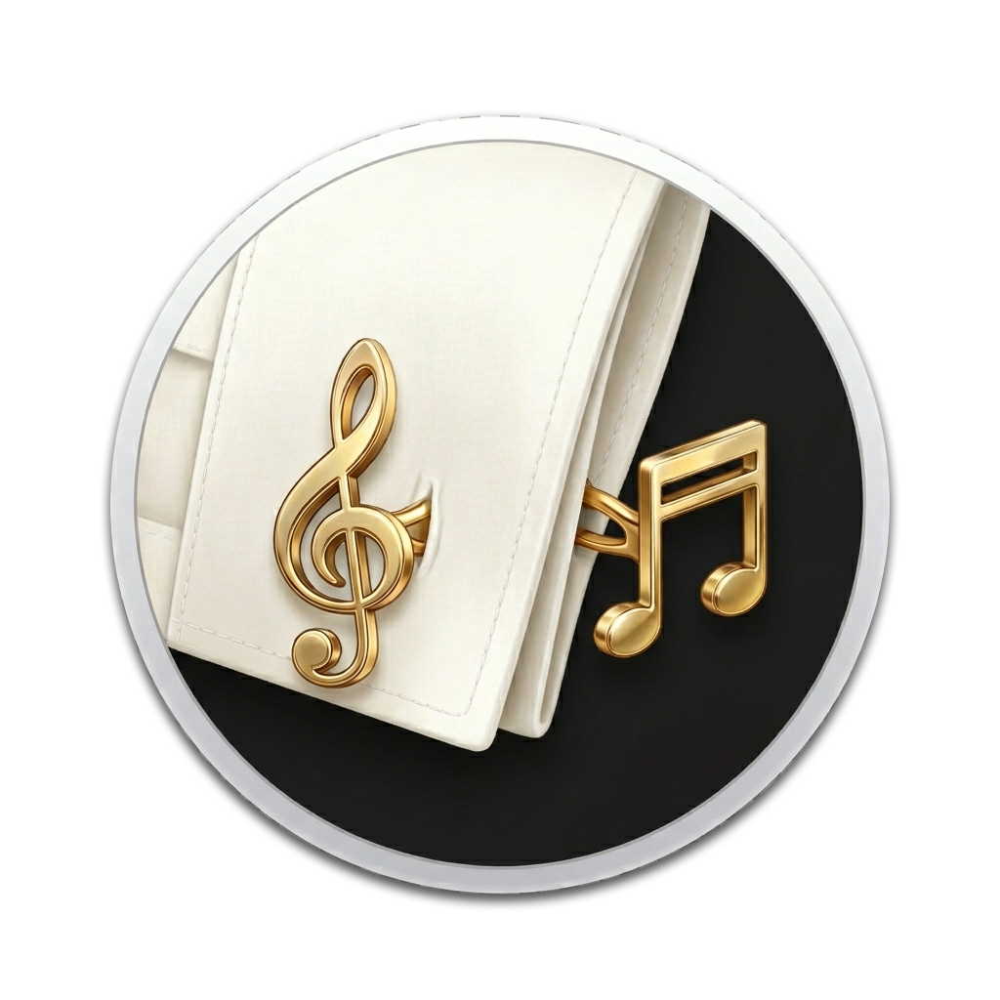

# Cufflinks

A cross-platform desktop widget that renders at the desktop level — below all application windows — and displays your current track: album art, song title, album, and artist.

Supports Spotify, TIDAL, and Apple Music. Scrobbles to Last.fm. Fully themeable with HTML/CSS/JS.



---

## Features

- **Desktop-level rendering** — sits above the wallpaper, below all windows (Windows WorkerW, macOS NSWindow level, Linux X11/Wayland)
- **Multi-source** — Spotify (local WebSocket + Web API), TIDAL (SMTC / tidal-hifi), Apple Music (AppleScript / SMTC)
- **Priority routing** — configure which source wins when multiple players are active
- **Last.fm scrobbling** — offline queue via SQLite, drains automatically on reconnect
- **Theming** — sandboxed HTML/CSS/JS themes via `<webview>`; ships with Minimal and Glassmorphic
- **Secure credentials** — OS keychain via keytar; safeStorage fallback. Tokens never touch the renderer

---

## Platform Support

| Feature | Windows | macOS | Linux |
|---|---|---|---|
| Desktop-level rendering | WorkerW | NSWindow level | X11 / wlr-layer-shell |
| Spotify | | | |
| TIDAL | SMTC | MediaRemote (exp.) | tidal-hifi only |
| Apple Music | SMTC | AppleScript | — |

---

## Getting Started

### Prerequisites

- Node.js 22 LTS
- pnpm 9+
- **Windows only:** `npx windows-build-tools` (as Administrator) for native addons
- **macOS only:** Xcode Command Line Tools (`xcode-select --install`)

### Install

```bash
git clone https://github.com/<org>/cufflinks.git
cd cufflinks
pnpm install
```

### Configure

Copy `.env.example` to `.env.local` and fill in your API keys:

```bash
cp .env.example .env.local
```

```env
SPOTIFY_CLIENT_ID=your_spotify_client_id
SPOTIFY_CLIENT_SECRET=your_spotify_client_secret
LASTFM_API_KEY=your_lastfm_api_key
LASTFM_SHARED_SECRET=your_lastfm_shared_secret
```

Get Spotify keys at [developer.spotify.com](https://developer.spotify.com/dashboard) and Last.fm keys at [last.fm/api](https://www.last.fm/api/account/create).

### Run

```bash
pnpm dev        # Development mode with HMR
pnpm build      # Production build
pnpm dist       # Package for distribution
```

---

## Themes

Themes live in `~/Cufflinks/themes/`. Two bundled themes ship with the app:

- **Minimal** — frosted glass pill with album art, title, and artist
- **Glassmorphic** — full blurred album art background with layered glass card

To create your own theme, see [docs/theme-authoring.md](docs/theme-authoring.md).

To open the themes folder: **system tray → Open Themes Folder**.

---

## Development

```bash
pnpm dev        # Electron + Vite HMR
pnpm lint       # ESLint
pnpm typecheck  # tsc --noEmit across all packages
pnpm test       # Vitest unit + Playwright e2e
```

### Monorepo Structure

```
packages/
  main/       Electron main process — sources, scrobbler, credentials, IPC
  renderer/   Settings UI (React + Vite)
  widget/     Widget window with sandboxed theme <webview> (React + Vite)
  shared/     Types, IPC channels, error classes (shared across all packages)
themes/
  minimal/
  glassmorphic/
docs/
  theme-authoring.md
  contributing.md
```

---

## Contributing

See [docs/contributing.md](docs/contributing.md) and the full contributor guide in [CLAUDE.md](CLAUDE.md).

The most impactful contribution is adding a new music source. The architecture is designed so that a new source touches exactly four files. See **Adding a New Music Source** in CLAUDE.md.

---

## License

[MIT](LICENSE)
